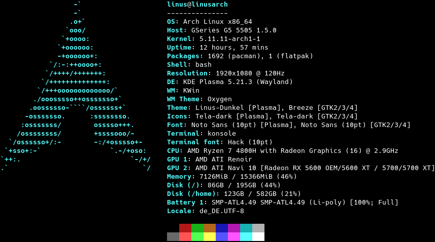

# fastfetch

fastfetch is a [neofetch](https://github.com/dylanaraps/neofetch)-like tool for fetching system information and displaying them in a pretty way. It is written in c to achieve much better performance, in return only Linux and Android are supported. It also uses mechanisms like multithreading and caching to finish as fast as possible.  
  
The output on my personal machine with default configurations looks like this:
  

## Customization

With customization and speed being two competing goals, this project actually builds two executables.  
The main one being `fastfetch`, which can be very greatly configured via flags. These flags can be made persistent in `~/.config/fastfetch/config.conf`. To view the available options run `fastfetch --help`.  
The second executable being built is called `flashfetch`, which is configured at compile time to eliminate any possible overhead. Configuration of it can be very easily done in [`src/flashfetch.c`](src/flashfetch.c).  
At the moment the performance difference is measurable, but too small to be human recognizable. But the leap will get bigger with more and more options coming, and on slow machines this might actually make a difference.  
  
There are some presets defined for fastfech in [`presets`](presets), you can can load them with `--load-config`. They may also serve as a good example for format arguments.

## Dependencies

Fastfetch dynamically loads needed libraries if they are available. Therefore its only hard dependencies are `libc` (any implementation of the c standard library), `libdl` and `libpthread`. They are all shipped with [`glibc`](https://www.gnu.org/software/libc/), which is already installed on most linux distributions, so you probably don't have to worry about it.  

The following libraries are used if present at runtime:
* [`libpci`](https://github.com/pciutils/pciutils): GPU output.
* [`libvulkan`](https://www.vulkan.org/): Vulkan module & fallback for GPU output.
* [`libxcb-randr`](https://xcb.freedesktop.org/),
    [`libXrandr`](https://gitlab.freedesktop.org/xorg/lib/libxrandr),
    [`libxcb`](https://xcb.freedesktop.org/),
    [`libX11`](https://gitlab.freedesktop.org/xorg/lib/libx11): At least one of them sould be present in X11 sessions for better resolution detection and faster WM detection. The `*randr` ones provide multi monitor support The `libxcb*` ones usually have better performance.
* [`libwayland-client`](https://wayland.freedesktop.org/): Better resolution performance and output in wayland sessions. Supports different refresh rates per monitor.
* [`libGIO`](https://developer.gnome.org/gio/unstable/): Needed for values that are only stored GSettings.
* [`libDConf`](https://developer.gnome.org/dconf/unstable/): Needed for values that are only stored in DConf + Fallback for GSettings.
* [`libmagickcore` (ImageMagick)](https://www.imagemagick.org/): Images in terminal using sixel or kitty graphics protocol.
* [`libchafa`](https://github.com/hpjansson/chafa): Image output as ascii art.
* [`libZ`](https://www.zlib.net/): Faster image output when using kitty graphics protocol.
* [`libDBus`](https://www.freedesktop.org/wiki/Software/dbus): Needed for detecting current media player and song.
* [`libEGL`](https://www.khronos.org/registry/EGL/),
    [`libGLX`](https://dri.freedesktop.org/wiki/GLX/),
    [`libOSMesa`](https://docs.mesa3d.org/osmesa.html): At least one of them is needed by the OpenGL module for gl context creation.
* [`libOpenCL`](https://www.khronos.org/opencl/): OpenCL module
* [`libXFConf`](https://gitlab.xfce.org/xfce/xfconf): Needed for XFWM theme and XFCE Terminal font.
* [`libsqlite3`](https://www.sqlite.org/index.html): Needed for rpm package count.
* [`librpm`](http://rpm.org/): Slower fallback for rpm package count. Needed on openSUSE.

## Support status
All categories not listed here should work without needing a specific implementation.

##### Available Modules
```
Title, Separator, OS, Host, Kernel, Uptime, Processes, Packages, Shell, Resolution, DE, WM, WMTheme, Theme, Icons, Font, Cursor, Terminal, Terminal Font, CPU, CPUUsage, GPU, Memory, Disk, Battery, Player, Song, Vulkan, OpenGL, OpenCL, LocalIP, PublicIP, DateTime, Date, Time, Locale, Colors, Break, Custom
```

##### Logos
```
Alpine, Android, Arch, Arco, Artix, Bedrock, CachyOS, CentOS, Debian, Devuan, Deepin, Endeavour, Fedora, Garuda, Gentoo, KDE Neon, KISS, Kubuntu, LangitKetujuh, Linux, Manjaro, Mint, NixOS, OpenSUSE, OpenSUSE Tumbleweed, OpenSUSE LEAP, Pop!_OS, RebornOS, RedstarOS, Rocky, Rosa, Ubuntu, Void, Zorin
```
* Most of the logos have a small variant. Access it by appending _small to the logo name.
* Some logos have an old variant. Access it by appending _old to the logo name.
* Unknown/unsupported logos will be replaced with a generic linux logo when running fastfetch.
* Get a list of all available logos with `fastfetch --print-logos`.
* Printing images as logo is supported using Sixel or Kitty graphics protocol.

##### Package managers
```
Pacman, dpkg, rpm, emerge, xbps, nix, Flatpak, Snap
```

##### WM themes
```
KWin, Mutter, Muffin, Marco, XFWM, Openbox (LXDE, LXQT & without DE)
```

##### DE versions
```
KDE Plasma, Gnome, Cinnamon, Mate, XFCE4, LXQt
```

##### Terminal fonts
```
konsole, gnome-terminal-server, tilix, xfce4-terminal, alacritty, lxterminal, TTY
```

## Building

fastfetch uses [`cmake`](https://cmake.org/) and [`pkg-config`](https://www.freedesktop.org/wiki/Software/pkg-config/) for building. The simplest steps to build the fastfetch and flashfetch binaries are:  
```bash
mkdir -p build
cd build
cmake ..
cmake --build . --target fastfetch --target flashfetch
```

If pkg-config fails to find the headers for a library listed in [dependencies](#dependencies), fastfetch will simply build without support for that specific feature. This means, it won't look for it at runtime and just act like it isn't available.

## Packaging

### Repositories

[](https://repology.org/project/fastfetch/versions)

### Manual

* DEB / RPM package: `cmake --build . --target package`
* Install directly: `cmake --install . --prefix /usr/local`

## FAQ

Q: Why do you need a very performant version of neofetch?
> I like putting neofetch in my ~/.bashrc to have a system overwiew whenever i use the terminal, but the slow speed annoyed me, so i created this. Also neofetch didn't output everything correctly (e.g Font is displayed as "[Plasma], Noto Sans, 10 [GTK2/3]") and writing my own tool gave me the possibility to fine tune it to run perfectly on at least my configuration.

Q: It does not display [*] correctly for me, what can i do?
> This is most likely because your system is not implemented (yet). At the moment i am focusing more on making the core app better, than adding more configurations. Feel free to open a pull request if you want to add support for your configuration
