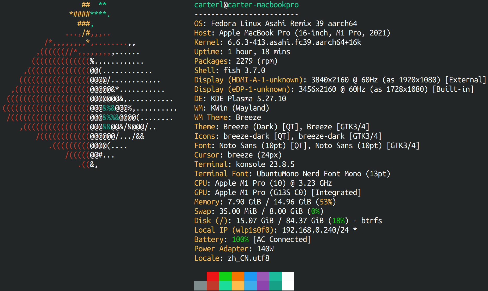
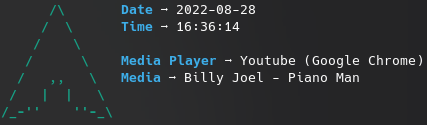
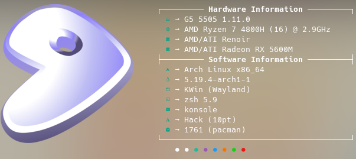
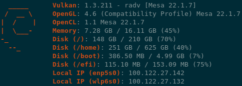
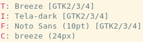

# Fastfetch

  

  

Fastfetch is a [neofetch](https://github.com/dylanaraps/neofetch)-like tool for fetching system information and displaying them in a pretty way. It is written mainly in C, with performance and customizability in mind. Currently, Linux, Android, FreeBSD, MacOS and Windows 7+ are supported.

There are [screenshots on different platforms](https://github.com/fastfetch-cli/fastfetch/wiki)

## Installation

### Linux

Some distros packaged an outdated fastfetch version. Older version is not supported, please always ensure that the latest version is used.

* Ubuntu: [`ppa:zhangsongcui3371/fastfetch`](https://launchpad.net/~zhangsongcui3371/+archive/ubuntu/fastfetch) (for Ubuntu 22.04 or newer)
* Debian / Ubuntu: Download `fastfetch-linux-<proper architecture>.deb` from [Github release page](https://github.com/fastfetch-cli/fastfetch/releases/latest) and `dpkg -i fastfetch-linux-<proper architecture>.deb` (for Ubuntu 20.04 or newer and Debian 11 or newer).
* Arch Linux: `sudo pacman -S fastfetch`
* Fedora: `sudo dnf install fastfetch`
* Gentoo: `sudo emerge --ask app-misc/fastfetch`
* Alpine: `apk add --upgrade fastfetch`
* NixOS: `nix-shell -p fastfetch`
* openSUSE: `sudo zypper install fastfetch`
* ALT Linux: `sudo apt-get install fastfetch`

Replace sudo with doas depending on what you use.

[See also if fastfetch has been packaged for your favorite Linux distro](#Packaging).

If fastfetch is not packaged for your distro or an outdated version is packaged, [linuxbrew](https://brew.sh/) is a good alternate: `brew install fastfetch`

### macOS

...via [HomeBrew](https://brew.sh):

`brew install fastfetch`

...via [MacPorts](https://www.macports.org):

`sudo port install fastfetch`

### Windows

`scoop install fastfetch`

You may also download it directly from [GitHub releases page](https://github.com/fastfetch-cli/fastfetch/releases/latest) and extract the archive.

### FreeBSD

`pkg install fastfetch`

### Android (Termux)

`pkg install fastfetch`

## Build from source

See Wiki: https://github.com/fastfetch-cli/fastfetch/wiki/Building

## Usage

* Run it with default configuration: `fastfetch`
* Run it with [all supported modules](https://github.com/fastfetch-cli/fastfetch/wiki/Support+Status#available-modules) and find what you interest: `fastfetch -c all.jsonc`
* Find all data that fastfetch detects: `fastfetch -s <module> --format json`
* Display help messages: `fastfetch --help`
* Generate config file based on command line arguments: `fastfetch --arg1 --arg2 --gen-config`

## Customization

Fastfetch uses the JSONC (or JSON with comments) for configuration. [See Wiki for detail](https://github.com/fastfetch-cli/fastfetch/wiki/Configuration). There are some premade config files in [`presets`](presets), including the ones used for the screenshots above. You can load them using `-c <filename>`. They may also serve as a good example for format arguments.

Logos can be heavily customized too; see the [logo documentation](https://github.com/fastfetch-cli/fastfetch/wiki/Logo-options) for more information.

## Packaging

### Repositories

### Manual

* DEB / RPM package: `cmake --build . --target package`
* Install directly: `cmake --install . --prefix /usr/local`

## FAQ

Q: Why do you need a very performant version of neofetch?
> I like putting neofetch in my ~/.bashrc to have a system overview whenever I use the terminal, but the slow speed annoyed me, so I created this. Also neofetch didn't output everything correctly (e.g Font is displayed as "[Plasma], Noto Sans, 10 [GTK2/3]") and writing my own tool gave me the possibility to fine tune it to run perfectly on at least my configuration.

Q: It does not display [*] correctly for me, what can I do?
> This is most likely because your system is not implemented (yet). At the moment I am focusing more on making the core app better, than adding more configurations. Feel free to open a pull request if you want to add support for your configuration

## Star History

Give it a star to support us!

<a href="https://star-history.com/#fastfetch-cli/fastfetch&Date">
  <picture>
    <source media="(prefers-color-scheme: dark)" srcset="https://api.star-history.com/svg?repos=fastfetch-cli/fastfetch&type=Date&theme=dark" />
    <source media="(prefers-color-scheme: light)" srcset="https://api.star-history.com/svg?repos=fastfetch-cli/fastfetch&type=Date" />
    
  </picture>
</a>
