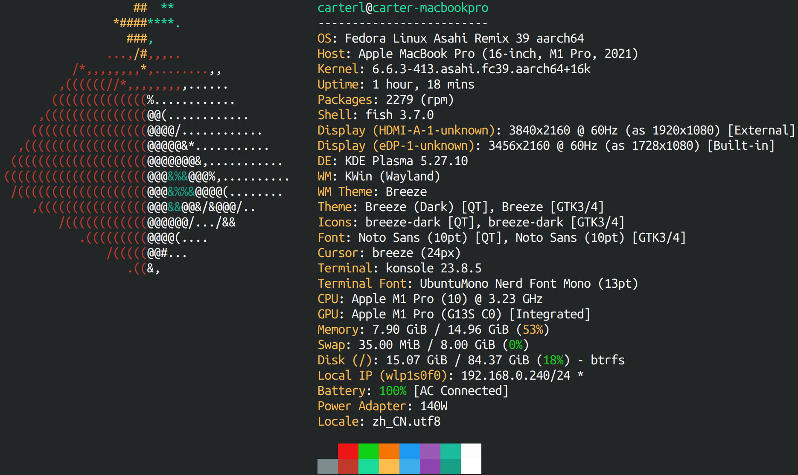
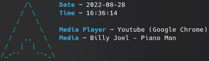
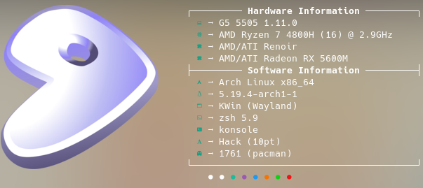
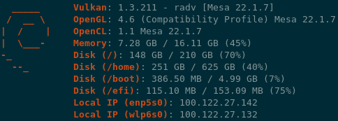
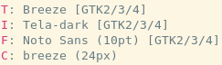

# Fastfetch (dustlinux port)


Fastfetch is a [neofetch](https://github.com/dylanaraps/neofetch)-like tool for fetching system information and displaying it in a visually appealing way. It is written mainly in C, with a focus on performance and customizability. Currently, it supports Linux, macOS, Windows 7+, Android, FreeBSD, OpenBSD, NetBSD, DragonFly, Haiku, illumos (SunOS), and Solaris.









According configuration files for examples are located [here](https://github.com/fastfetch-cli/fastfetch/tree/dev/presets/examples).

There are [screenshots on different platforms](https://github.com/fastfetch-cli/fastfetch/wiki).

## Usage

* Run with default configuration: `fastfetch`
* Run with [all supported modules](https://github.com/fastfetch-cli/fastfetch/wiki/Support+Status#available-modules) to find what interests you: `fastfetch -c all.jsonc`
* View all data that fastfetch detects: `fastfetch -s <module1>[:<module2>][:<module3>] --format json`
* Display help messages: `fastfetch --help`
* Generate a minimal config file: `fastfetch [-s <module1>[:<module2>]] --gen-config [</path/to/config.jsonc>]`
    * Use: `--gen-config-full` to generate a full config file with all optional options

## Customization

Fastfetch uses JSONC (JSON with comments) for configuration. [See the Wiki for details](https://github.com/fastfetch-cli/fastfetch/wiki/Configuration). There are some premade config files in the [`presets`](presets) directory, including those used for the screenshots above. You can load them using `-c <filename>`. These files can serve as examples of the configuration syntax.

Logos can also be heavily customized; see the [logo documentation](https://github.com/fastfetch-cli/fastfetch/wiki/Logo-options) for more information.

### WARNING

Fastfetch supports a `Command` module that can run arbitrary shell commands. If you copy-paste a config file from an untrusted source, it may contain malicious commands that can harm your system or compromise your privacy. Please always review the config file before using it.

## FAQ

### Q: Neofetch is good enough. Why do I need fastfetch?

1. Fastfetch is actively maintained.
2. Fastfetch is faster, as the name suggests.
3. Fastfetch has a greater number of features, though by default it only has a few modules enabled; use `fastfetch -c all` to discover what you want.
4. Fastfetch is more configurable. You can find more information in the Wiki: <https://github.com/fastfetch-cli/fastfetch/wiki/Configuration>.
5. Fastfetch is more polished. For example, neofetch prints `555 MiB` in the Memory module and `23 G` in the Disk module, whereas fastfetch prints `555.00 MiB` and `22.97 GiB` respectively.
6. Fastfetch is more accurate. For example, [neofetch never actually supports the Wayland protocol](https://github.com/dylanaraps/neofetch/pull/2395).

### Q: Fastfetch shows my local IP address. Does it leak my privacy?

A local IP address (10.x.x.x, 172.x.x.x, 192.168.x.x) has nothing to do with privacy. It only has meaning if you are on the same network, for example, if you connect to the same Wi-Fi network.

Actually, the `Local IP` module is the most useful module for me personally. I (@CarterLi) have several VMs installed to test fastfetch and often need to SSH into them. With fastfetch running on shell startup, I never need to type `ip addr` manually.

If you really don't like it, you can disable the `Local IP` module in `config.jsonc`.

### Q: Where is the config file? I can't find it.

Fastfetch does not generate a config file automatically. You can use `fastfetch --gen-config` to generate one. The config file will be saved in `~/.config/fastfetch/config.jsonc` by default. See the [Wiki for details](https://github.com/fastfetch-cli/fastfetch/wiki/Configuration).

### Q: The configuration is so complex. Where is the documentation?

Fastfetch uses JSON (with comments) for configuration. I suggest using an IDE with JSON schema support (like VSCode) to edit it.

Alternatively, you can refer to the presets in the [`presets` directory](https://github.com/fastfetch-cli/fastfetch/tree/dev/presets).

The **correct** way to edit the configuration:

This is an example that [changes size prefix from MiB / GiB to MB / GB](https://github.com/fastfetch-cli/fastfetch/discussions/1014). Editor used: [helix](https://github.com/helix-editor/helix)

[](https://asciinema.org/a/1uF6sTPGKrHKI1MVaFcikINSQ)

### Q: I WANT THE DOCUMENTATION!

[Here is the documentation](https://github.com/fastfetch-cli/fastfetch/wiki/Json-Schema). It is generated from the [JSON schema](https://github.com/fastfetch-cli/fastfetch/blob/dev/doc/json_schema.json), but you might not find it very user-friendly.

### Q: How can I customize the module output?

Fastfetch uses `format` to generate output. For example, to make the `GPU` module show only the GPU name (leaving other information undisplayed), you can use:

```jsonc
{
    "modules": [
        {
            "type": "gpu",
            "format": "{name}" // See `fastfetch -h gpu-format` for details
        }
    ]
}
```

...which is equivalent to `fastfetch -s gpu --gpu-format '{name}'`

See `fastfetch -h format` for information on basic usage. For module-specific formatting, see `fastfetch -h <module>-format`

### Q: I have my own ASCII art / image file. How can I show it with fastfetch?

Try `fastfetch -l /path/to/logo`. See the [logo documentation](https://github.com/fastfetch-cli/fastfetch/wiki/Logo-options) for details.

If you just want to display the distro name in [FIGlet text](https://github.com/pwaller/pyfiglet):

```bash
# install pyfiglet and jq first
pyfiglet -s -f small_slant $(fastfetch -s os --format json | jq -r '.[0].result.name') && fastfetch -l none
```


### Q: My image logo behaves strangely. How can I fix it?

See the troubleshooting section: <https://github.com/fastfetch-cli/fastfetch/wiki/Logo-options#troubleshooting>

### Q: Fastfetch runs in black and white on shell startup. Why?

This issue usually occurs when using fastfetch with `p10k`. There are known incompatibilities between fastfetch and p10k instant prompt.
The p10k documentation clearly states that you should NOT print anything to stdout after `p10k-instant-prompt` is initialized. You should put `fastfetch` before the initialization of `p10k-instant-prompt` (recommended).

You can always use `fastfetch --pipe false` to force fastfetch to run in colorful mode.

### Q: Why do fastfetch and neofetch show different memory usage results?

See [#1096](https://github.com/fastfetch-cli/fastfetch/issues/1096).

### Q: Fastfetch shows fewer dpkg packages than neofetch. Is it a bug?

Neofetch incorrectly counts `rc` packages (packages that have been removed but still have configuration files remaining). See bug: https://github.com/dylanaraps/neofetch/issues/2278

### Q: I use Debian / Ubuntu / Debian-derived distro. My GPU is detected as `XXXX Device XXXX (VGA compatible)`. Is this a bug?

Try upgrading `pci.ids`: Download <https://pci-ids.ucw.cz/v2.2/pci.ids> and overwrite the file `/usr/share/hwdata/pci.ids`. For AMD GPUs, you should also upgrade `amdgpu.ids`: Download <https://gitlab.freedesktop.org/mesa/drm/-/raw/main/data/amdgpu.ids> and overwrite the file `/usr/share/libdrm/amdgpu.ids`

Alternatively, you may try using `fastfetch --gpu-driver-specific`, which will make fastfetch attempt to ask the driver for the GPU name if supported.

### Q: I get the error `Authorization required, but no authorization protocol specified` when running fastfetch as root

Try `export XAUTHORITY=$HOME/.Xauthority`

### Q: Fastfetch cannot detect my awesome 3rd-party macOS window manager!

Try `fastfetch --wm-detect-plugin`. See also [#984](https://github.com/fastfetch-cli/fastfetch/issues/984)

### Q: How can I change the colors of my ASCII logo?

Try `fastfetch --logo-color-[1-9] <color>`, where `[1-9]` is the index of color placeholders.

For example: `fastfetch --logo-color-1 red --logo-color-2 green`.

In JSONC, you can use:

```jsonc
{
    "logo": {
        "color": {
            "1": "red",
            "2": "green"
        }
    }
}
```

### Q: How do I hide a key?

Set the key to a white space.

```jsonc
{
    "key": " "
}
```

### Q: How can I display images on Windows?

As of April 2025:

#### mintty and Wezterm

mintty (used by Bash on Windows and MSYS2) and Wezterm (nightly build only) support the iTerm image protocol on Windows.

In `config.jsonc`:  
```json
{
  "logo": {
    "type": "iterm",
    "source": "C:/path/to/image.png",
    "width": <num-in-chars>
  }
}
```

#### Windows Terminal

Windows Terminal supports the sixel image protocol only.

* If you installed fastfetch through MSYS2:
    1. Install imagemagick: `pacman -S mingw-w64-<subsystem>-x86_64-imagemagick`
    2. In `config.jsonc`:  
```jsonc
{
  "logo": {
    "type": "sixel", // DO NOT USE "auto"
    "source": "C:/path/to/image.png", // Do NOT use `~` as fastfetch is a native Windows program and doesn't apply cygwin path conversion
    "width": <image-width-in-chars>, // Optional
    "height": <image-height-in-chars> // Optional
  }
}
```
* If you installed fastfetch via scoop or downloaded the binary directly from the GitHub Releases page:
    1. Convert your image manually to sixel format using [any online image conversion service](https://www.google.com/search?q=convert+image+to+sixel)
    2. In `config.jsonc`:  
```jsonc
{
  "logo": {
    "type": "raw", // DO NOT USE "auto"
    "source": "C:/path/to/image.sixel",
    "width": <image-width-in-chars>, // Required
    "height": <image-height-in-chars> // Required
  }
}
```

### Q: I want feature A / B / C. Will fastfetch support it?

Fastfetch is a system information tool. We only accept hardware or system-level software feature requests. For most personal uses, I recommend using the `Command` module to implement custom functionality, which can be used to grab output from a custom shell script:

```jsonc
// This module shows the default editor
{
    "modules": [
        {
            "type": "command",
            "text": "$EDITOR --version | head -1",
            "key": "Editor"
        }
    ]
}
```

Otherwise, please open a feature request in [GitHub Issues](https://github.com/fastfetch-cli/fastfetch/issues).

### Q: I have questions. Where can I get help?

* For usage questions, please start a discussion in [GitHub Discussions](https://github.com/fastfetch-cli/fastfetch/discussions).
* For possible bugs, please open an issue in [GitHub Issues](https://github.com/fastfetch-cli/fastfetch/issues). Be sure to fill out the bug report template carefully to help developers investigate.

## Donate

If you find Fastfetch useful, please consider donating.

* Current maintainer: [@CarterLi](https://paypal.me/zhangsongcui)
* Original author: [@LinusDierheimer](https://github.com/sponsors/LinusDierheimer)

## Code signing

* Free code signing provided by [SignPath.io](https://about.signpath.io/), certificate by [SignPath Foundation](https://signpath.org/)
* This program will not transfer any information to other networked systems unless specifically requested by the user or the person installing or operating it

## Star History

Give us a star to show your support!

<a href="https://star-history.com/#fastfetch-cli/fastfetch&Date">
  <picture>
    <source media="(prefers-color-scheme: dark)" srcset="https://api.star-history.com/svg?repos=fastfetch-cli/fastfetch&type=Date&theme=dark" />
    <source media="(prefers-color-scheme: light)" srcset="https://api.star-history.com/svg?repos=fastfetch-cli/fastfetch&type=Date" />
    
  </picture>
</a>
